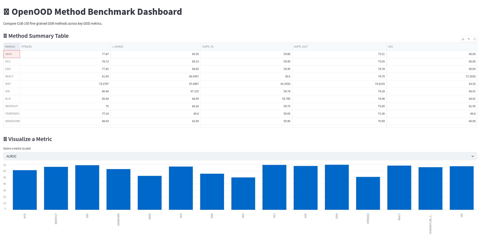

# CUBs OSR Dashboard

## Overview
This interactive Streamlit dashboard visualizes and compares performance metrics across multiple Open Set Recognition (OSR) methods applied to the **CUB-200** fine-grained image dataset using the [OpenOOD](https://github.com/Jingkang50/OpenOOD) benchmark framework.

## ▶️ Running the Dashboard
1. **Install dependencies**
   ```bash
   pip install -r requirements.txt
   
2. **Run with Streamlit**
    ```bash
    streamlit run app.py

## 📊 Sample Dashboard
